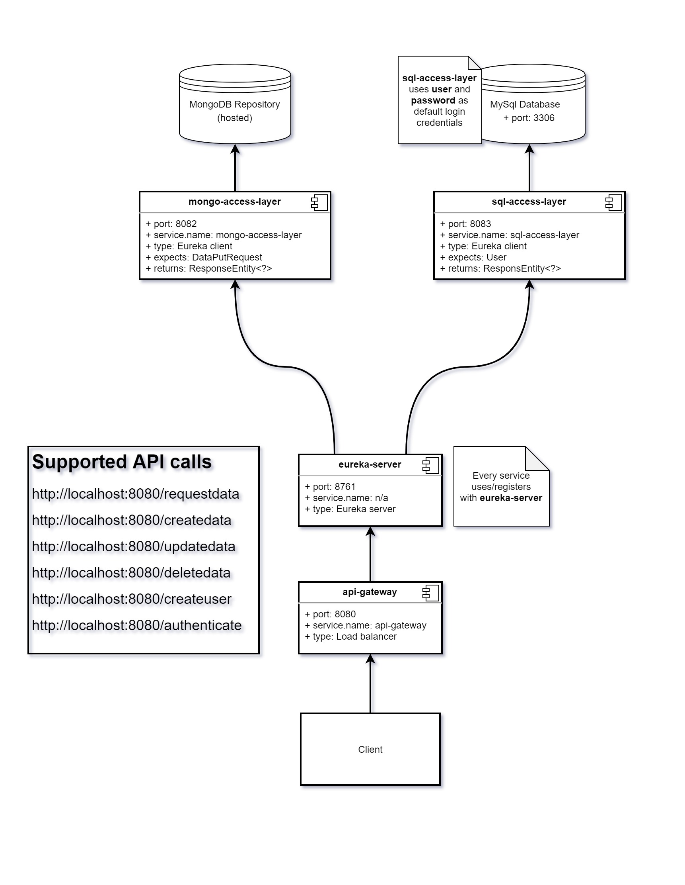

### Welcome to the CancerUp Repository!

### Prequisites:
- MySql Community Server
- MySql Workbench (Not required but recommended)
- Java 8.0

### Microservice architecture design
To put it simply, there is no defined definition.
The way we are implementing it involves each service communicating through HTTP, which means each service runs on its own dedicated port.
Each service registers with a Eureka server, and when the client requests a particular service the Eureka server can pass along the right url to the client.
This is great, because it means you can load balance and spin up multiple of the same services, and then distribute the load across those services.

### Getting started
First, download MySql Server and Workbench (not required but recommended)
- [MySql Installer](https://dev.mysql.com/downloads/installer/)

Next download the project as a .zip or clone the repo to a directory of your choosing.
It is important to set up the MySql database exactly, or else Spring won't be able to save or get users.
You can import the attached [Database](test-database.sql) from the MySql workbench, and it will automatically set up the schema and tables correctly.

*Note:*
- Make sure SqlServer is running as a service. You can check this to happen automatically in the installer.
- The login for a default user is `username=root, passsword=password`

The default structure for how the microservices are structured is layed out below. Any arrow you see pointing is a dependancy/communication with another service.
If you wish to use the */getdata* service, you must also have the */getuser* service running too.

*Note:*
- Since each service uses the Eureka Server, it must be the first service running so each subsequent service can register with it. Nothing will work if the Eureka Server is not running.

*Note:* You can change the port of any service by navigating to */projectname/src/main/resources/application.properties* and changing the *server.port* value.

### Return types / Expected Values
#### /adduser
- Method=`POST`
- Content-Type=`application-json`
- Body=User.java
  `{
  "email":"email-here",
  "password":"password-here"
  }`

- Return:
  - HttpStatus=`201 (CREATED)`
  - Type=`Mono<ResponseEntity<Void>>`

#### /savedata (default data is pre-written for you)
- Method=`POST`
- Content-Type=`application-json`
- Header=`Authorization:jwt`
- Return:
  - HttpStatus=`201 (CREATED)`
  - Type=`Mono<ResponseEntity<Void>>`
  - Body=`{"jwt":"jwt-token"}`

#### /getdata
- Method=`GET`
- Content-Type=`application-json`
- Header=`Authorization:jwt`
- Return:
  - HttpStatus=`200 (OK)`
  - Type=`Mono<ResponseEntity<Object>>`
  - Body=`Object`

#### /authenticate
- Method=`POST`
- Content-Type=`application-json`
- Body=`{"email":"your-email-here", "password":"your-password-here"}`
- Return:
  - HttpStatus=`200 (OK)`
  - Type=`Mono<ResponseEntity<AuthenticationResponse>>`
  - Body=`{"jwt":"jwt-token"}`
